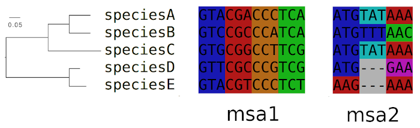

# ClaMSA - **Cla**ssify **M**ultiple **S**equence **A**lignments 
ClaMSA is tool that uses machine learning to classify sequences that are related to each other via a tree. It takes as input a tree and a multiple sequence alignment (MSA) of sequences and outputs probabilities that the MSA belongs to given classes.
It is currently trained and tested to classify sequences of codons (= triplets of DNA characters) into coding (1) or non-coding (0).
It builds on TensorFlow and a custom layer for Continuous-Time Markov Chains (CTMC) and **trains a set of rate matrices** for a classification task.



# Requirements
  Python modules
 - tensorflow >= 2.0
 - regex
 - newick
 - tqdm
 - protobuf3-to-dict

Install requirements with
```console
pip install tensorflow regex newick tqdm gzip pandas protobuf3-to-dict
```

# Installation

Download ClaMSA with
```console
git clone git clone --recurse-submodules https://github.com/Gaius-Augustus/clamsa.git
```

# Example Classification
The commands
```console
cd clamsa

./clamsa.py predict fasta examples/msa.lst --clades examples/example_tree.nwk --use_codons
```
output the table
```
path                    clamsa
examples/msa1.fa        0.9585
examples/msa2.fa        0.2802
```
Here, the two toy example alignments `msa1`, `msa2` pictured above are predicted as likely coding (0.9585) and rather non-coding (0.2802), respectively.  
See the [usage of prediction](docs/usage-predict.md) for an explanation of the command line structure.  
See [test/predict.sh](test/predict.sh) for more explanations and a realistical application.

# Data
Obtain
  1. codon alignment training data from a fly, vertebrate and yeast clade in tfrecords format and
  2. codon alignment test data from vertebrates in fasta format with
  
```konsole
cd data
./download_fly_vert_yeast_train.sh
./download_vert_test.sh
```

# Training
ClaMSA can be trained for a classification task on a training set of labeled MSAs.  
See [test/train.sh](test/train.sh) for more explanations and the command line that ClaMSA was trained with.


# Utilities
  - [MSA conversion](docs/conversion.md)

# Reference
Most of ClaMSA was written by Darvin Mertsch.  

Please cite:  
[End-to-end Learning of Evolutionary Models to Find Coding Regions in Genome Alignments](https://www.biorxiv.org/content/10.1101/2021.03.09.434414v1), Darvin Mertsch and Mario Stanke, *bioRxiv* 2021.03.09.434414
