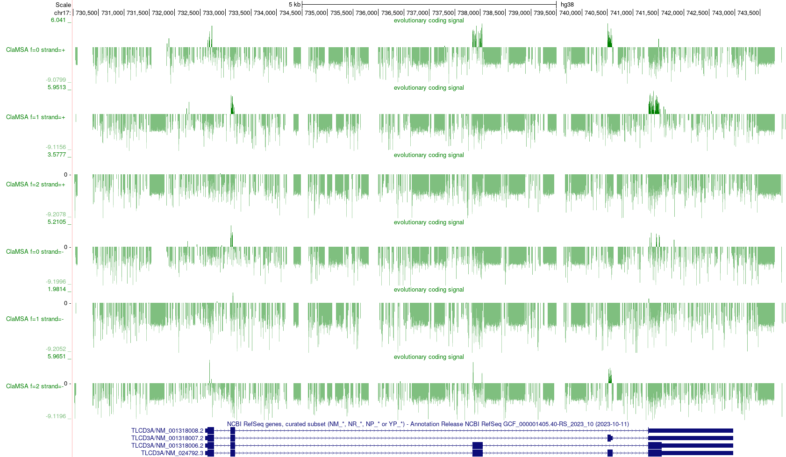

# Scanning a genome for signals of protein-coding sites

ClaMSA can be used to classify each triplet in a genome multiple alignment as coding or not. In this mode, it receives a MAF formatted multiple sequence alignment of genomes. It outputs for all aligned triplets in the first aligned genome (reference) the probability that it is coding.

ClaMSA outputs 6 files in UCSCs WIG format for the 6 possible reading frames. At each site the output is the logit of the probability that the codon alignment starting at that site is coding. Each output number is only based on 3 columns and not considering any further context. 

Example files are in `examples/coding_sitewise/`.
```
cd examples/coding_sitewise/
```

Run ClaMSA on the example input with
```
../../clamsa.py predict maf TLCD3A-diverse64.maf --clades diverse64.nwk\
	--sitewise --use_codons \
	--model_ids '{ "diverse64mammals" : "mammals-sitewise" }' \
	--out coding_sitewise # output stem
```
Here, `diverse64.nwk` is a tree of 64 diverse mammalian species that matches the species names in the MAF input file `TLCD3A-diverse64.maf`. The tree is scaled to 1 expected codon mutation per time unit.

Above command produces 6 output files `coding_sitewise{0..5}.wig`, such that frames 0, 1, 2 are on the forward and frames 3, 4, 5 are on the reverse strand. These files can be uploaded as custom tracks to the UCSC genome browser to produce a visualization as this:

```
../../utilities/make_wig_track.sh coding_sitewise chr17:730000-744000
```



## Machine learning model

The ClaMSA CTMC (continuous-time Markov chain) layer is followed by a small multilayer perceptron (2 dense layers) and was trained in a supervised fashion on a modest set of 64-way mammalian alignments, in which 14% of sites were coding.